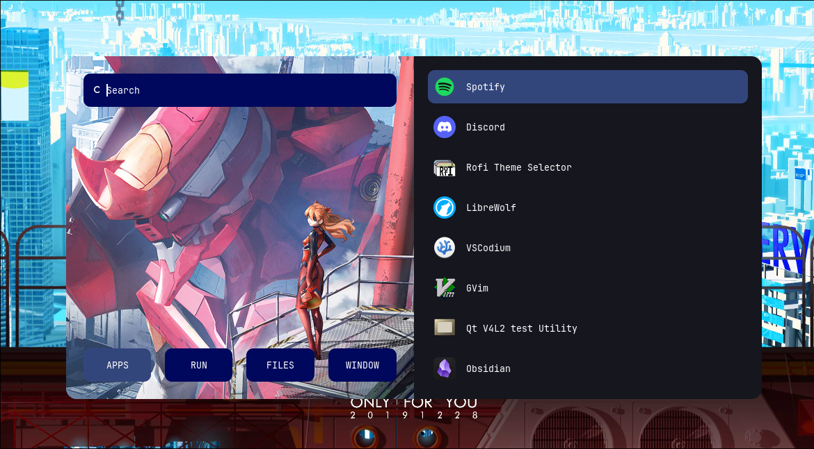

# ARCH Linux Dotfiles

Personal Arch Linux + Hyprland configuarion for my ThinkPad T480. This repo contains my window manager, waybar, rofi, kitty, audio visualizer, scripts, themes, and desktop utilities. 

## Environment

OS - Arch Linux \
WM - Hyprland \
Taskbar - Waybar \
Terminal - Kitty \
Launcher/Menu - Rofi \
Shell - zsh \
Hardware - Thinkpad T480 \

## Components

### Hyprland
Window manager configuration, workspaces, window rules,
keybindings, and desktop behavior.

#### Desktop Image

### Waybar
Modular status bar configuration with system information,
workspaces, media controls, and Cava visualization.

### Rofi
Custom launcher and desktop control interface.

## Installation

> This repository is primarily designed for my personal system.
> It is not currently intended to be a one-command installation.